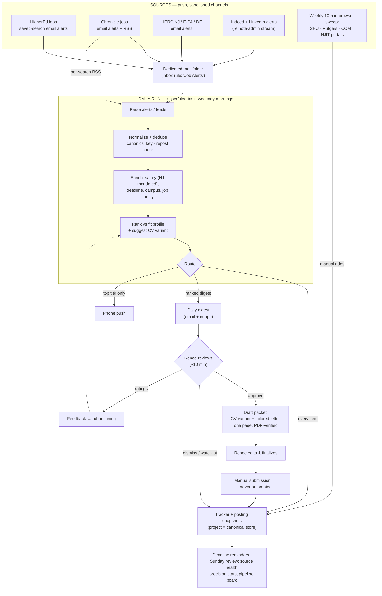
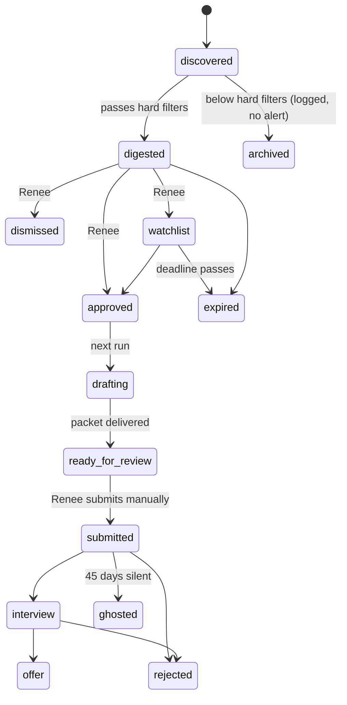

# Higher-Ed Job Search Automation — Workflow Design & Validation

**Prepared for:** Renee (operator) — candidate profile built on Max Mihir Oza's materials in the CV-shu project
**Date:** August 19, 2026
**Status:** Design for review. Nothing has been built. Every factual claim about boards, portals, pricing, and law was verified against live sources today; items that could not be verified are marked as such.

---

## 1. Executive summary

The system you described is worth building, but not the way the request framed it. Three findings from today's research reshape the design:

**First, the scope is staff/admin + adjunct, not faculty** — you confirmed this, and it matters: staff roles post year-round and close in roughly two to four weeks, so the system's value is *never missing a window and applying fast*, not monitoring an annual faculty cycle.

**Second, direct portal scraping is a dead end, empirically.** I tested every portal on your list today. Seton Hall's serves a blank page to automated readers (the same CAPTCHA wall that blocked the Senior Budget Analyst posting this morning). Rutgers, CCM, FDU, Essex, and Union County's PeopleAdmin portals block robots outright. Montclair, Stevens, Kean, and William Paterson run Workday, which serves an empty JavaScript shell with no listing data in it. Ramapo's NEOGOV portal blocks robots. And the walls are growing, not shrinking — the industry shifted toward default bot-blocking in 2025–26 (Cloudflare made AI-crawler blocking the default for new domains in July 2025). A scraping-first architecture would spend its life fighting walls it should not fight.

**Third, the walls don't matter, because the coverage problem is already solved by push channels.** Seton Hall, Montclair, and CCM staff *and adjunct* postings all cross-post to HigherEdJobs (verified with current posting IDs today); SHU, Montclair, Rutgers, Princeton, and FDU also post to the NJ/Eastern-PA/Delaware HERC. HigherEdJobs, the Chronicle's job board, and HERC all offer **free saved-search email alerts** — the Chronicle's without even creating an account. The boards will *push* the postings to you daily, through a channel they built for exactly this purpose, with zero terms-of-service exposure and zero scraper maintenance.

**The recommended architecture is therefore an alert-parser, not a scraper:** saved-search alerts flow into a dedicated mail folder; a scheduled daily run parses them, dedupes against the tracker, extracts salary (which NJ law has required in postings since June 2025) and deadlines, ranks everything against the fit profile, updates the tracker, and delivers a ranked digest by email and in-app with phone push for top-tier finds. Drafting is **approval-gated**: nothing is written until you say yes, and then the packet is generated from the CV variant library that today's three SHU packages already seed. Submission is never automated. Steady-state cost: roughly $0 in new software and 30–60 minutes of your week.

---

## 2. The objective, reframed around your real constraint

Your stated constraint — *reduce noise and alert fatigue, even at the cost of finding fewer jobs* — combined with your noise budget answer (15–40 surfaced/week, "I'll be the scorer") defines the system precisely:

- **Hard filters do the gatekeeping** (geography, job family, position type). These are deterministic and auditable.
- **Scoring does the *ranking and annotation***, not the gatekeeping. Its job is to put the two postings that matter at the top of a 20-item digest, attach the salary, deadline, commute, and suggested CV variant to each line, and get out of the way.
- **Everything that passes hard filters is logged; only the digest interrupts you; only top-tier fits touch your phone.** Nothing is silently discarded above the hard-filter line, so you never wonder what the system withheld.

One assumption I've made and you should confirm: the fit profile is built from Max's corpus (enrollment/admissions, academic operations, budget/finance — the three SHU packages), and you are the operator receiving alerts. If the adjunct stream needs a discipline list (adjunct *what* — business? writing? — see §14), that is the single biggest open input.

---

## 3. Your assumptions, challenged

**3.1 — "Faculty and higher education positions."** The materials in this project are staff/administrative packages, and you confirmed staff + adjunct scope. This is not pedantry; it inverts the design. Faculty searches run on an annual cycle with October–January deadlines and are superbly covered by aggregators; discovery latency barely matters. Staff roles at NJ publics post continuously, sometimes close in two weeks, and are sometimes reposted or filled internally. For staff, the scarce resource is *your application turnaround time*, not discovery. The system should optimize time-from-posting-to-submitted, which is mostly a drafting-and-tracking problem, not a search problem.

**3.2 — "Monitor university employment portals directly."** Tested today, portal by portal: of 20 institutions audited, exactly three (Caldwell, Drew, Centenary) serve plain HTML a machine can read — and Centenary's own site says its openings are listed on HigherEdJobs, while Drew's employment pages showed stale-content risk (a sampled posting dated 2019). Everything else is bot-walled (SHU/PageUp, all PeopleAdmin schools, Ramapo/NEOGOV, HigherEdJobs itself) or a JavaScript shell (all Workday schools, NJIT/Cornerstone, all ADP community colleges). Meanwhile the cross-posting spot-check verified that SHU, Montclair, and CCM staff and adjunct postings appear on HigherEdJobs with current IDs. **Portals should be a 10-minute weekly human sweep of three or four institutions, not the pipeline's backbone.** The one clean exception: Princeton staff runs on iCIMS with publicly viewable listings and a talent-network signup — worth its own alert.

**3.3 — "More sources = better coverage."** Coverage across the major boards overlaps heavily, and every added source adds parse failures, duplicates, and noise — the exact things you said you fear. Two of your five named boards should be dropped outright: **Chronicle Vitae no longer exists** (the domain now serves the Chronicle's main site; job seeking lives at jobs.chronicle.com), and **AcademicCareers.com is decaying** — free, technically alive, but its default search surfaced no NJ results at all, its FAQ cites a 2011 rule, and its newest visible postings trailed today by months. Inside Higher Ed is alive and well-built but thin for NJ (50 NJ postings vs. the Chronicle's 519, of which 191 administrative, on the day I checked). Start with **three pillars — HigherEdJobs, Chronicle jobs, HERC — plus Indeed/LinkedIn alerts for the remote-admin stream**, and add sources only when the pilot proves a specific miss.

**3.4 — "The system searches the sources."** Better: the sources search themselves and push to you. All three pillars offer free saved-search email alerts (Chronicle: daily or weekly, no account needed; HigherEdJobs: alerts via free account; HERC: custom alerts via free account). The Chronicle and IHE also expose per-search RSS feeds. A push architecture is more reliable (no walls), cheaper (no fetch infrastructure), legally clean (you're using the feature they built), and nearly maintenance-free (when a board redesigns its website, its alert emails keep working). The system's ingestion step becomes "read a mail folder," which is boring — and boring is what you want under your reliability constraint.

**3.5 — "Runs once or twice per day."** Twice daily buys you ~12 hours of latency on roles that stay open two to four weeks; it roughly doubles run volume for almost no decision advantage. The alert emails themselves arrive daily at best (no board offers an "instant" tier I could verify). **One weekday morning run is the right default**, with an optional light afternoon pass during the September–October surge. What actually needs vigilance is not discovery latency but **deadlines on roles you've approved** — that's a reminder problem the tracker solves.

**3.6 — "Generate a customized CV and cover letter for each promising position."** At your chosen volume (15–40 surfaced/week), auto-drafting "promising" items would mint 60–160 documents a month, most never read. That's cost without benefit, plus two real harms: version sprawl in your materials library, and anchoring — a mediocre auto-draft tends to become the submitted draft. §8 gives the full policy; the short version is **draft only after your approval, and never auto-submit**.

**3.7 — The implicit one: "discovery is the bottleneck."** For NJ staff hiring it usually is not. The three SHU applications built this morning are the actual bottleneck pattern: finding the posting was easy; producing a tailored, one-page, ATS-sane packet and tracking it to submission is where the hours go. Expect the drafting-and-tracking half of this system to produce more interviews than the discovery half. Budget your attention accordingly.

---

## 4. What the source research found (verified today)

### 4.1 Source decision table

| Source | Verdict | Ingestion channel | Why |
|---|---|---|---|
| **HigherEdJobs** | **Pillar** | Saved-search **email alerts** (free account). Site itself is behind an Imperva bot wall — do not fetch. RSS URL patterns exist (`/search/rss.cfm?JobCat=…`, `?AID=<institution>`) but were unreachable to automated fetch; may work in a normal RSS reader — test in Phase 1 | Strongest NJ institutional coverage; **CCM relies on it**; SHU & Montclair staff + adjunct verified cross-posted with current IDs |
| **Chronicle jobs** (jobs.chronicle.com) | **Pillar** | **Email alerts** (daily/weekly, no account) + **per-search RSS** (`/jobsrss/`, live today) | Deepest NJ inventory audited: 519 NJ postings (191 administrative), postings dated within 48h, salaries shown. Replaces defunct Vitae |
| **HERC — NJ/Eastern PA/Delaware chapter** | **Pillar** | **Email alerts** (free account). Job board itself is CAPTCHA-walled — do not fetch | Verified members posting now: SHU, Rutgers, Montclair, Princeton, FDU. Staff/Administrative is a first-class category. Thin for CCM |
| **Inside Higher Ed Careers** | Secondary | Weekly email alert (no account) or RSS | Same platform family as Chronicle but ~10× thinner for NJ (50 postings). Weekly cadence is enough; catches the occasional exclusive |
| **Indeed + LinkedIn** | Secondary (remote stream) | Email alerts (Indeed: account, daily/weekly; LinkedIn: ~10-alert cap, daily/weekly — cap per third-party source, unverified) | Best coverage of **remote higher-ed admin** roles (enrollment ops, OPM-adjacent) that never touch academic boards |
| **NJ Civil Service Commission** (nj.gov/csc/jobs) | Optional, Phase 3 | Manual/monthly check | Some *classified* support-staff titles at state universities (e.g., Montclair clerical/support roles) are announced through CSC, not only university portals |
| **University portals (SHU, Rutgers, CCM, Montclair…)** | **Weekly human sweep, not pipeline** | 10-minute browser check of 3–4 portals; optional alert signups where offered (Princeton talent network; Workday accounts) | Machine-hostile (see §4.2); cross-posting makes daily portal checks ~redundant; sweep exists to catch the exception and to audit aggregator coverage |
| **AcademicCareers.com** | **Dropped** | — | No NJ results surfaced; maintenance decay; stale listings |
| **Chronicle Vitae** | **Dropped** | — | Service no longer exists; domain redirects to Chronicle main content |

### 4.2 Portal reality (full table in Appendix A)

The pattern across all 20 institutions audited: **PageUp (SHU) and all PeopleAdmin sites (Rutgers, CCM, FDU, Essex, UCNJ) and NEOGOV (Ramapo) actively block automated readers; Workday (Montclair, Stevens, Kean, WPU), Cornerstone (NJIT), and ADP (Bergen, Passaic, Sussex, St. Elizabeth) serve JavaScript shells with no listing data in plain HTML.** Princeton (iCIMS) is partially readable and offers a talent-network signup. Only Caldwell, Drew, and Centenary serve plain HTML. No portal RSS feed could be positively verified anywhere.

Two design consequences. First, ingestion must not depend on fetching these portals. Second, the weekly sweep should target the institutions that matter most to you and cross-post least: **SHU (verify aggregator copies against the live portal — this morning's Budget Analyst case), Rutgers (one universitywide portal, jobs.rutgers.edu, covers Newark — filter by campus), CCM (HigherEdJobs-reliant; HERC-thin), and NJIT** (membership/coverage ambiguous in both aggregators).

### 4.3 What NJ law gives you for free

Since **June 1, 2025** (P.L. 2024, c. 91; N.J.S.A. 34:6B-23), NJ employers with 10+ employees — **explicitly including public employers** — must state the hourly wage or salary (or a range) plus a general description of benefits in each new posting. Practical effect: nearly every posting the system ingests carries a machine-extractable salary band (the Chronicle listings audited today showed them: e.g., Enrollment Services Administrator $74,568; Sr. Accountant $85–95K). Salary becomes a first-class scoring and filtering field, not a research task.

---

## 5. Legal, ethical, and terms-of-service analysis

You asked for this directly, so here is the current landscape (all case citations verified today; this is background, not legal advice — I'm not a lawyer).

**The law on monitoring public job boards.** *Van Buren v. United States* (2021) narrowed the Computer Fraud and Abuse Act to a "gates-up-or-down" test — the CFAA polices access to areas you cannot enter, not purposes. *hiQ v. LinkedIn* (9th Cir. 2022) applied that to scraping: accessing public-facing pages requiring no login is likely not "without authorization" under the CFAA. But hiQ then **lost on contract** — it had assented to LinkedIn's User Agreement via accounts — and ended under a permanent injunction plus $500K. *Meta v. Bright Data* (N.D. Cal. 2024) closed the loop from the other side: logged-out scraping of public pages did not breach Meta's terms, because the terms govern *users* and Bright Data wasn't using the service as one. The 2025–26 docket (Reddit v. Anthropic, remanded to state court March 2026; Reddit v. Perplexity et al., S.D.N.Y., Oct 2025) shows contract and tort theories are alive and well against scrapers even where copyright and CFAA fail. Synthesis for your use case: **reading public pages politely and logged-out is the weak-exposure zone; creating an account, assenting to terms, and then automating against the site is the hiQ trap.**

**What the specific terms say.** The Chronicle's terms expressly prohibit "robots or spiders or other automated devices *or manual processes* to monitor or gather any data from the Site." HERC's terms contain no anti-scraping clause (only anti-harvesting of user data). Inside Higher Ed's jobseeker terms grant "personal use only" with no scraping clause. HigherEdJobs' terms could not be retrieved (the terms page itself is bot-walled) — treat it conservatively.

**The clean resolution: use the channels the boards built for machines and repetition.** Email alerts and RSS feeds *are* the sanctioned automation surface — the Chronicle bans scraping *and* operates public RSS feeds and an email-alert service, which tells you exactly how they want to be monitored. An alert email delivered to your inbox is yours to process however you like. This design therefore has near-zero ToS exposure: alerts in, no bulk fetching, no walls circumvented. Where the system fetches at all (Chronicle/IHE RSS, an individual posting URL to snapshot the description of a job you're pursuing, the three plain-HTML college sites), it does so at human-scale volume — a handful of requests a day — which is indistinguishable from you opening the page.

**Bright lines I recommend (and that I will hold to when operating this):** never bypass a CAPTCHA or bot wall — when a source blocks, the system records "blocked, verify manually" and falls back to aggregator copies, exactly as this morning's SHU Budget Analyst package handled it; never automate *inside* a logged-in session against a site whose terms you've assented to; keep fetch volume polite and identifiable; respect robots.txt.

**Ethics beyond ToS.** Three that matter more than the scraping question: (1) **Never auto-submit applications.** Beyond error risk, ATS submissions typically end with a certification that the applicant reviewed and attests to the materials — a bot clicking that on Max's behalf makes it false. Higher-ed admin in North Jersey is a small professional community; one garbled auto-application to a registrar's office travels. (2) **Every factual claim in generated materials must trace to Max's master corpus.** The drafting step tailors emphasis and framing; it never invents experience, titles, or dates. Human review of every packet before submission is a hard gate, not a nicety. (3) **PII containment:** the corpus and tracker stay in storage you control (this project / your OneDrive); postings are public data, but Max's materials are not, and they should not transit services that aren't part of the workflow.

---

## 6. Recommended architecture — "Alerts in, judgment in the middle, files out"

### 6.1 Shape

### 6.2 Where each piece lives

| Component | Implementation | Notes |
|---|---|---|
| Alert intake | Saved searches on the 3 pillars + Indeed/LinkedIn, delivering to your mailbox; an inbox rule files them to a **Job Alerts** folder | One-time setup, ~45 min (Appendix B has the exact searches). A dedicated free mailbox is an alternative if you want zero contact with your real inbox |
| Daily run | **Scheduled task in this app** (weekday mornings, ~7:00 ET). Reads the alert folder via the **Microsoft 365 connector** (exists in the registry; Outlook email search — you'd connect it once) and/or fetches the Chronicle/IHE RSS feeds directly | Each run is a fresh session in this same environment with this project attached. First pilot run verifies the connector + project read/write end-to-end |
| Parsing, dedupe, scoring, drafting | The model doing the run — this is where an LLM genuinely outperforms flow tools: reading messy alert emails, spotting that two boards carry the same job, extracting a deadline phrased three ways, ranking against a rubric, writing in Max's register | No AI add-on licenses needed |
| Canonical store | **This project**: `tracker` doc, `fit-profile`, `rubric`, `/snapshots/` (full text of every pursued posting — postings vanish; today's SHU case proves the need), `/materials/` (master CVs, the three SHU variant packages, letter templates) | Survives across sessions and devices; every scheduled run reads/writes it |
| Human-facing tracker mirror | Your choice: a Google Sheet (Drive connector already connected) or a weekly `tracker.xlsx` delivered to you / saved to OneDrive | Canonical stays in the project so runs never depend on a mirror being reachable |
| Digest & alerts | In-app digest each run + **email + push via the scheduled task's built-in completion notifications** (both channels, zero extra plumbing). Optional later: a formatted email digest sent via Zapier (already connected) or Outlook | Matches your "both" answer |
| Approval loop | You reply in-app (or mark the sheet): approve / dismiss / watchlist / rate. Next run picks up approvals and drafts | Also works asynchronously from your phone |
| Drafting | On approval: pick nearest CV variant (admissions / ops / budget — the SHU packages seed this library), tailor, write the letter, render to PDF, verify one page, deliver for your review | Same procedure that produced today's three packages |
| Submission | **You, manually**, in the institution's ATS. The packet includes a submission checklist (portal, account, references, questions to expect) | Hard boundary — see §5 |
| Health & review | Per-source freshness watermark; Sunday weekly review: deadline board, pipeline status, precision stats, "source X quiet for N days" flags | The defense against silent failure — see §10 |

**Cost:** ~$0 incremental. Every component uses subscriptions you already have. The boards' alerts are free; the M365 connector, Google Drive connector, Zapier free tier, and scheduled tasks are already available to you.

---

## 7. Alternative architectures

**B — Microsoft 365-native.** Power Automate reads the Job Alerts folder, parses with expressions/AI, writes to a SharePoint list, Teams approvals gate drafting, Copilot drafts documents. *For:* single-vendor, IT-friendly, approvals UX is genuinely good; standard-connector scheduled flows are already included in M365. *Against:* the judgment steps are the weak link — parsing messy alert HTML and scoring fit in Power Automate means AI Builder, which is being retired (end of sale Nov 2025; credits die Nov 2026) in favor of consumption-billed Copilot Credits ($0.01/credit, $200/25K packs), on top of Power Automate Premium ($15/user/mo) if you touch premium connectors, on top of M365 Copilot ($30/user/mo enterprise, or the new $18–21 Business SKU) for drafting. Copilot Studio's scheduled autonomous agents and computer-use browsing reached GA only in May 2026 — young, consumption-billed, unproven for this. You'd pay more to get worse judgment, though the *plumbing* is solid.

**C — Low-code glue (Zapier / Make / n8n).** Email Parser by Zapier (still alive) or Make watches the folder, an AI step scores, rows land in a Sheet, a digest email goes out. *For:* fast to stand up; Zapier free tier (100 tasks/mo) may even cover low volume; Make Core is $12/mo. *Against:* per-board parser templates are brittle against email-format drift; task counts balloon in September; scoring quality depends on cramming your rubric into prompt steps; drafting still has to happen somewhere else. Reasonable as *plumbing*, redundant if the daily run already does the judgment.

**D — Custom code.** Python + IMAP/RSS ingestion + SQLite + an LLM API for scoring/drafting, on GitHub Actions cron (free tier: 2,000 min/mo private repos) or a $5 VPS. *For:* total control and portability; cheapest to run; no platform dependency. *Against:* 30–60 hours to build well; you own scraper rot, schema drift, and API changes; GitHub's scheduler delays or drops runs under load and auto-disables inactive workflows; and the moment it touches portals directly you inherit the §5 walls. This is the Phase 3 "hardening" option if you ever want independence from any app, not the starting point.

### 7.1 Comparison

| Dimension | **A — Alerts + scheduled run (rec.)** | B — M365-native | C — Low-code glue | D — Custom code |
|---|---|---|---|---|
| Build effort | ~2–4 h setup, no code | 15–30 h flow-building | 6–12 h | 30–60 h |
| Incremental cost | **~$0** | $15–48+/user/mo + credits | $0–20/mo | ~$0–10/mo + API |
| Parsing/scoring/drafting quality | High (native LLM judgment) | Low–medium, and in licensing flux | Medium | High (you build it) |
| Reliability profile | Push channels; few moving parts | Solid plumbing, fragile AI layer | Parser brittleness | You are the SRE |
| Maintenance | ~30 min/mo | 2–4 h/mo | 1–3 h/mo | 2–6 h/mo, spiky |
| ToS/legal posture | Cleanest (sanctioned channels only) | Clean | Clean | Depends on restraint |
| Lock-in / portability | Tied to this app for the run; data all in open files | Deep M365 | Medium | None |
| Failure visibility | Built-in notifications + weekly heartbeat | Good (flow alerts) | Medium | You build it |

Honest note on A's main dependency: the daily run lives in this app's scheduler. The mitigation is that *the data never does* — alerts keep arriving in your mailbox regardless, and the tracker, snapshots, and materials are ordinary files you can take anywhere, which keeps D available as an exit ramp at any time.

---

## 8. When should CVs and cover letters be generated? (your question 8)

**After approval. Firmly.** The policy:

1. **At discovery (free, automatic):** each top-tier digest item carries a three-line *tailoring brief* — suggested CV variant (admissions / ops / budget), the angle a letter would take, salary band, deadline, and any red flags (repost, pooled adjunct, civil-service title). This is the cheap 80% of tailoring's *decision* value with none of its cost.
2. **At approval (one word from you):** the full packet is drafted — nearest CV variant re-angled, fresh letter, one page, rendered to PDF and verified, delivered same day with a submission checklist. Today's three SHU packages are exactly this step done manually; the variant library they seed is what makes it fast.
3. **Escalation rule, data-driven:** if ≥70% of top-tier items get your approval for three consecutive weeks, flip top-tier to draft-ahead — at that precision, pre-drafting stops being waste. Revisit in the Sunday review; don't start there.
4. **Never auto-submit.** Unconditional, for the §5 reasons.

Why not draft-ahead from day one: at 15–40 surfaced/week it produces a haystack of unread documents; a plausible-but-generic auto-draft anchors the final letter downward ("it's already written") — the SHU letters worked because each had a real angle chosen for that posting; and version sprawl in the materials library is itself a defect the tracker then has to manage.

---

## 9. What level of automation is realistic?

| Stage | Realistic automation | Notes |
|---|---|---|
| Discovery | ~90–95% | Alert-driven; the residual is the weekly portal sweep |
| Dedupe / normalize / archive | ~100% | Deterministic given the canonical-key scheme |
| Enrichment (salary, deadline, family) | ~90% | NJ salary law helps; unparseable deadlines are flagged "verify," never guessed |
| Ranking / digest | 100% mechanical; judgment quality grows with your feedback | Weeks 1–2 will be mediocre until ratings accumulate |
| Drafting | ~70% | First drafts to the quality bar of today's SHU packages; your edit pass is mandatory and is where voice and judgment live |
| Submission | ~0% by design | Checklist-assisted, human-executed |
| Status tracking | ~80% | Automatic through drafting; "submitted" and outcomes need your one-word confirmations (Phase 3 can scan confirmation emails) |
| Outcome analytics | 100% once statuses flow | Funnel: surfaced → approved → submitted → interview |

The honest summary: this system can reliably take over the *collection, memory, and first-draft* labor — roughly 80% of the weekly hours — while leaving the 20% that determines outcomes (choosing targets, final voice, relationships, submission) with you. Promises beyond that (auto-apply, guaranteed coverage of walled portals) would be either unethical or brittle, and I'd rather design for the version that still works in March.

---

## 10. Failure points and mitigations

The failure that kills systems like this is not dramatic breakage — it's **silent decay**: a source stops producing, nobody notices, and three weeks later you realize the "quiet market" was a broken pipe. Every mitigation below assumes failures will be invisible unless made visible.

| # | Failure mode | Likelihood | Mitigation |
|---|---|---|---|
| 1 | **Silent source death** — a board changes its alert format, an alert subscription lapses, a saved search gets corrupted | High, eventually certain | Per-source freshness watermark (`last_item_seen_at`). Any pillar quiet >7 days (>14 for secondaries) gets flagged in the digest and Sunday review. The system never infers "no jobs" from "no data" |
| 2 | Alert emails diverted to spam / clutter | Medium | Inbox rule whitelists the senders into the Job Alerts folder; the watermark (above) catches it if the rule breaks |
| 3 | **Duplicate misses** — same job on 3 boards under slightly different titles | Certain without design | Canonical key = normalized institution + normalized title + location; fuzzy match against 60 days of tracker history; board-specific IDs (HigherEdJobs JobCode, HERC ID, ATS req #) stored as aliases |
| 4 | **Reposts and evergreen pools** — adjunct pools that never close; staff roles reposted after failed searches | High (adjunct pools guarantee it) | `pooled` flag suppresses re-alerts (resurfaced quarterly); repost detection (same canonical key reappearing >30 days later) annotates rather than re-alerts — a repost is signal, sometimes good (search failed, bar may drop), sometimes bad |
| 5 | **Deadline extraction errors** — the one error class that costs a real opportunity | Medium | Deadlines are extracted conservatively: unparseable → `close_date_confidence: unknown` and "verify manually" in the digest, never a guessed date; approved roles with unknown deadlines get treated as "apply within 72h" |
| 6 | Posting taken down before you apply | Medium (happened today: SHU 497461) | Full-text snapshot archived at first sight for any item that clears the digest bar; drafting works from the snapshot |
| 7 | Scoring drift / miscalibration | Medium | Your ratings are the training signal; rubric is a readable doc you can edit; Sunday review reports precision ("you rated 14/22 worth seeing") |
| 8 | September–October volume surge blows the noise budget | High, seasonal | Digest hard cap (~15/day) with ranked overflow to the weekly review; per-family and per-institution mute switches |
| 9 | Connector auth expiry (M365 / Google) | Medium | Run preamble checks connectivity; failure → immediate notification naming the reconnect step, and the run still processes RSS-sourced items |
| 10 | Scheduled run fails or the app's scheduler has an outage | Low–medium | Run-completion notifications double as heartbeat; a missed morning digest is itself the alert. Alerts keep accumulating in the mailbox — nothing is lost, the next run catches up |
| 11 | Bot walls escalate to remaining fetch surfaces (RSS, plain-HTML sites) | Medium (the trend of 2025–26) | Architecture already treats fetching as optional enrichment; degrade to email-only mode with no functional loss |
| 12 | **Operator fatigue** — the human loop (your 10 min/day) lapses | The real killer | The system tolerates absence: nothing expires unseen without a deadline warning; watchlist and weekly rollup mean skipping three days costs one longer skim, not missed roles |

---

## 11. Data structure

Canonical store = plain files in this project (survives sessions; portable; no database until the data earns one — likely never at this volume).

**`postings` (tracker, one row per canonical job):**

| Field | Type / values | Notes |
|---|---|---|
| `id` | slug, e.g. `2026-0219-shu-asst-registrar` | Human-readable |
| `canonical_key` | normalized inst + title + location | Dedupe anchor |
| `sources[]` | `{board, board_id, url, seen_at}` | All copies; aliases for dedupe |
| `institution`, `campus` | text | Rutgers rows carry campus (Newark vs NB) |
| `title` | text | As posted |
| `job_family` | enum: admissions/enrollment · academic-ops · budget/finance · registrar · student-services · advising · adjunct-〈discipline〉 · other | Drives hard filters + CV variant |
| `position_type` | staff-FT · staff-PT · adjunct-pool · temp/interim | |
| `modality` | onsite · hybrid · remote | Remote stream feeds from Indeed/LinkedIn |
| `salary_min/max` | numbers | NJ-mandated since 6/2025; missing = flag |
| `posted_date`, `first_seen`, `last_seen` | dates | Repost detection |
| `close_date`, `close_date_confidence` | date + stated/inferred/unknown | §10 #5 policy |
| `score`, `score_reasons` | 0–100 + 2 lines | Rank within digest, never silent gatekeeping above hard filters |
| `cv_variant` | admissions · ops · budget · new-variant | Suggested at digest, confirmed at drafting |
| `status` | see lifecycle below | |
| `snapshot_path`, `notes` | | |

**Status lifecycle:**

**`applications` (one row per submission):** `posting_id`, materials paths + versions, `submitted_date`, portal/account used, confirmation received (y/n), references required/sent, follow-up dates, interview notes.

**`sources` (health register):** `source_id`, type (email-alert / RSS / manual-sweep), query definition, `last_run`, `last_item_seen_at`, items/30d, health flag.

**Project file layout:** `tracker.md` (the three tables), `fit-profile.md`, `rubric.md`, `snapshots/…`, `materials/` (master CV + the three SHU variant packages + letter templates), `weekly-reviews/…`. Human mirror (Google Sheet or `tracker.xlsx`) regenerated from canonical, never edited as the source of truth — except a `decision` column, which the run reads back.

---

## 12. A day in the life (Tuesday, September 29, 2026 — peak season)

**7:02 am** — Scheduled run starts. Mailbox check: 9 alert emails overnight (HigherEdJobs ×3 searches, Chronicle ×2, HERC ×1, Indeed ×2, LinkedIn ×1) containing 41 postings. RSS pass adds 3. Parse → 44 raw items → dedupe collapses cross-posts and knocks out 12 already tracked → 19 new canonical postings. Hard filters pass 11. Enrichment pulls salary bands on 10 of 11 (one flagged), deadlines on 7 (four "verify"). Scoring ranks them; two clear the top tier.

**7:14 am** — Tracker updated (11 new rows, 2 snapshots archived for the top tier). Digest posts in-app and lands in your inbox; your phone buzzes once, for the 91: *Assistant Registrar, Seton Hall, $58–66K, closes Oct 9, variant: ops, angle: Banner + academic-operations coordination; the posting mirrors half the Academic Operations Coordinator letter you already have.* Below it: #2 Montclair Admissions Counselor (87, variant: admissions), then nine ranked lines each with salary/deadline/family, then two housekeeping notes: *"CCM quiet on HERC 9 days — normal, CCM barely uses HERC; HigherEdJobs CCM feed healthy"* and *"yesterday's approval drafted — see below."*

**7:25 am** — The packet for Monday's approval (FDU Enrollment Services Administrator) is delivered: re-angled admissions CV + fresh one-page letter, PDF-verified, with a checklist (FDU PeopleAdmin portal, account exists, 3 references, expect a salary-expectation field: band posted $60–72K).

**8:40 am, on your phone** — Four words in the chat: "approve 1, watchlist 2." Total attention spent: about nine minutes.

**5:30 pm** — Optional light run (surge season only): 6 new items, none clear the digest bar, no interruption; SHU packet from this morning's approval is drafted and waiting.

**Sunday 8:00 am** — Weekly review posts: pipeline board (2 ready for review, 1 submitted this week, 3 watchlist with deadlines Oct 9/12/17), precision stat (you rated 16/23 digest items worth seeing — 70%; rubric holding), source health (all pillars green), the 10-minute portal sweep list (SHU, Rutgers-Newark, CCM, NJIT — with direct links), and one suggestion: *"admissions-family approval rate is 3× ops-family; want ops demoted to weekly rollup?"*

Your total weekly time: **30–60 minutes**, plus real work only where it counts — editing packets for roles you chose.

---

## 13. Ongoing maintenance

| Horizon | Architecture A (rec.) | What it consists of |
|---|---|---|
| Daily | 5–10 min (you) | Read digest, approve/dismiss |
| Weekly | 15–25 min (you) | Sunday review + portal sweep + packet edits (drafting review is "real work," not maintenance) |
| Monthly | ~30 min | Rubric tweak from precision stats; re-check one saved search against the live board |
| Quarterly | ~1 h | Re-validate saved searches & alert subscriptions; prune tracker; refresh master CV facts |
| Annual | ~1–2 h | Source landscape re-check (boards die — Vitae did; walls move) |

Comparables: B adds 2–4 h/mo of flow babysitting plus licensing churn (AI Builder retirement is mid-flight); C adds 1–3 h/mo of parser repair; D adds 2–6 h/mo of code and breakage, spiking whenever an ATS or board changes. The alert-driven design is specifically the one whose maintenance does *not* scale with other people's website redesigns.

---

## 14. Phased implementation plan

**Phase 0 — Decisions and scaffolding (this week; ~2–3 h, mostly clicks).**
Lock the two open inputs: the **adjunct discipline list** (the one thing I cannot infer from Max's corpus) and confirmation that the fit profile should weight admissions/enrollment ≥ academic-ops ≥ budget/finance. Then: create the saved-search alerts per Appendix B (3 pillars + Indeed/LinkedIn); set the inbox rule → *Job Alerts* folder; connect the Microsoft 365 connector (or start RSS-only); I draft `fit-profile.md` and `rubric.md` from Max's corpus for your sign-off; seed the tracker with the three live SHU applications (they immediately get deadline tracking). *Exit: first alert emails arriving in the folder; profile and rubric approved.*

**Phase 1 — Pilot: collect → digest (weeks 1–3).**
Daily weekday scheduled run; digest via app + email/push; **no automated drafting yet** (drafts on request only — the manual path stays available throughout). Measure: precision (your ratings), volume vs. the 15–40 budget, dedupe correctness, and **coverage** — each Sunday sweep doubles as an audit: anything found on a portal that the pillars missed is logged as a coverage gap. *Exit criteria: two consecutive weeks with ≥60% of digest items rated worth seeing, zero known-posting misses, all pillar watermarks green. Adjust triggers: HigherEdJobs alerts unusable → test RSS-reader fallback; CCM gaps → add its portal to a twice-weekly sweep.*

**Phase 2 — Approve → draft → track (weeks 3–6).**
Approval loop live; packet generation from the variant library (one page, PDF-verified, submission checklist); deadline reminders (72h and 24h); repost suppression; Sunday review in full form; tracker mirror (Sheet or xlsx — your pick). *Exit: first three packets drafted-on-approval and submitted; drafting turnaround ≤24h; no missed deadlines.*

**Phase 3 — Selective hardening (only what the pilot proves necessary).**
Candidates, strictly evidence-gated: Princeton iCIMS polling or talent-network signup, if Princeton matters and the pillars under-cover it; NJ Civil Service Commission monthly check, if classified support titles are in scope; browser-assisted portal sweep automation for SHU/CCM, if manual sweeps keep finding gaps; confirmation-email scanning to auto-set `submitted`; outcome analytics (surfaced→approved→submitted→interview funnel) once ~20 applications accumulate; and only if you ever want independence from this app, the custom-code exit ramp (D) — the data formats are already portable by design.

**Explicit kill criterion for the whole system:** if after four tuned weeks precision stays under 40% *or* your weekly time exceeds ~90 minutes without interviews entering the funnel, stop and rethink scope (usually: narrow families, drop the remote stream, or raise the digest bar) rather than adding machinery.

---

## 15. Open decisions for you

1. **Adjunct disciplines** — which subjects should the adjunct stream match? (Blocks Phase 0.)
2. **Fit-profile weighting** — admissions/enrollment vs. academic-ops vs. budget/finance ordering, and salary floor if any.
3. **Mailbox** — alerts into your real inbox (rule-filed) or a dedicated free address?
4. **Tracker mirror** — Google Sheet (connector already live) or weekly xlsx to OneDrive?
5. **Confirm the operator/candidate framing** — digests and approvals to you; materials in Max's name and voice.

---

## Appendix A — Institutional portal audit (verified Aug 19, 2026)

| Institution | Portal | ATS | Machine access | On HigherEdJobs? | On HERC? |
|---|---|---|---|---|---|
| Seton Hall | jobs.shu.edu | PageUp | **Blocked** (blank page/CAPTCHA) | **Yes — staff + adjunct (verified)** | **Yes (member; verified)** |
| Montclair State | montclair.wd1.myworkdayjobs.com | Workday | JS shell | **Yes (verified)** | **Yes (member; verified)** |
| Rutgers (all campuses incl. Newark) | jobs.rutgers.edu | PeopleAdmin | **Blocked** (robots) | Yes | **Yes (member; verified)** |
| Princeton | service-/hub-princeton.icims.com (staff); dof.princeton.edu (academic) | iCIMS | Partially readable; talent-network signup | — | **Yes (member; verified)** |
| County College of Morris | jobs.ccm.edu | PeopleAdmin | **Blocked** (robots) | **Yes — staff + adjunct pools (verified)** | Thin/likely non-member |
| FDU | jobs.fdu.edu | PeopleAdmin | **Blocked** (robots) | Yes | **Yes (member; verified)** |
| Ramapo | schooljobs.com/careers/ramapo | NEOGOV | **Blocked** (robots) | Yes (typical) | Probable (dated roster) |
| Stevens | stevens.wd5.myworkdayjobs.com | Workday | JS shell | Yes (typical) | Likely not |
| NJIT | njit.csod.com | Cornerstone | JS shell (noindex) | Verify in pilot | Ambiguous |
| Drew | drew.edu/…/employment-opportunities | Custom | Readable; **stale-content risk** | Probable (dated roster) | Probable (dated roster) |
| Kean | kean.wd503.myworkdayjobs.com | Workday | JS shell (pattern) | — | — |
| William Paterson | wpunj.wd1.myworkdayjobs.com | Workday | JS shell (pattern); HR page points applicants to its HigherEdJobs profile | Yes (self-declared) | — |
| Caldwell | caldwell.edu/hr | Custom | **Readable HTML** (incl. adjunct page) | — | — |
| Centenary | centenaryuniversity.edu/human-resources | None (email apply) | Readable; **openings listed on HigherEdJobs per its own site** | Yes (self-declared) | — |
| Bergen CC / Passaic CCC / Sussex CCC / St. Elizabeth | ADP Workforce Now | ADP | JS app | Spot-check in pilot | — |
| Essex County College | essex.peopleadmin.com | PeopleAdmin | Blocked (pattern) | Spot-check in pilot | — |
| Union College of Union Co. | ucc.peopleadmin.com | PeopleAdmin | **Blocked** (robots) | Spot-check in pilot | — |

## Appendix B — Exact alert setup list (Phase 0)

1. **Chronicle jobs** (no account needed): daily email alerts + RSS for `jobs.chronicle.com/jobs/administrative/new-jersey/`; a second alert for adjunct once disciplines are locked. Note its ToS bans automated *site* monitoring — alerts/RSS are the sanctioned channels; we fetch only the RSS and individual postings we're pursuing.
2. **HigherEdJobs** (free account): saved searches — (i) Admin: admissions/enrollment + business/financial + academic-affairs categories, NJ + Remote; (ii) institution-specific: Seton Hall, Montclair, CCM, Rutgers, NJIT; (iii) adjunct search after disciplines lock. Email frequency: daily. *(Site is bot-walled — email is the only machine channel; test whether its RSS URLs work in a standard reader as a bonus.)*
3. **HERC NJ/Eastern PA/Delaware** (free account): custom alerts — Staff/Administrative × New Jersey; plus admissions/enrollment and business categories.
4. **Inside Higher Ed** (no account): one weekly alert, admin categories × NJ.
5. **Indeed** (account): two alerts — "university OR college (admissions OR enrollment OR registrar OR 'academic operations' OR bursar)" × within 25 mi of home ZIP, daily; same keywords × Remote, daily.
6. **LinkedIn**: equivalent two alerts (≈10-alert account cap reported — unverified; keep them broad).
7. **Inbox rule:** from any of the six senders → folder *Job Alerts*, skip inbox, never spam.
8. **Optional:** Princeton iCIMS talent-network signup; Workday account alerts at Montclair/Stevens if those schools rank high for you.

## Appendix C — Key sources

Board features & ToS: jobs.chronicle.com (/newalert/, /jobsrss/, /terms-and-conditions/) · careers.insidehighered.com (same paths) · higheredjobs.com (URL patterns via index; site bot-walled) · hercjobs.org (regional page, terms) · academiccareers.com · support.indeed.com. Portals: per-institution HR pages and ATS tenants listed in Appendix A. Law: *Van Buren v. United States*, 593 U.S. 374 (2021) · *hiQ v. LinkedIn*, 9th Cir. No. 17-16783 (Apr 18, 2022) + Nov 2022 SJ + Dec 2022 consent judgment · *Meta v. Bright Data*, No. 3:23-cv-00077 (N.D. Cal. Jan 23, 2024) · Reddit v. Anthropic remand (N.D. Cal. Mar 30, 2026) · Reddit v. Perplexity (S.D.N.Y. filed Oct 22, 2025) · Cloudflare AI-crawler default-block announcement (Jul 1, 2025) · NJDOL pay-transparency guidance, P.L. 2024 c. 91 / N.J.S.A. 34:6B-23 (eff. Jun 1, 2025). Platforms: Microsoft Power Automate pricing & licensing FAQ; AI Builder retirement notices; M365 Copilot & Copilot Studio pricing; Zapier, Make, n8n pricing pages; GitHub Actions billing & schedule-event docs (all fetched Aug 19, 2026).

